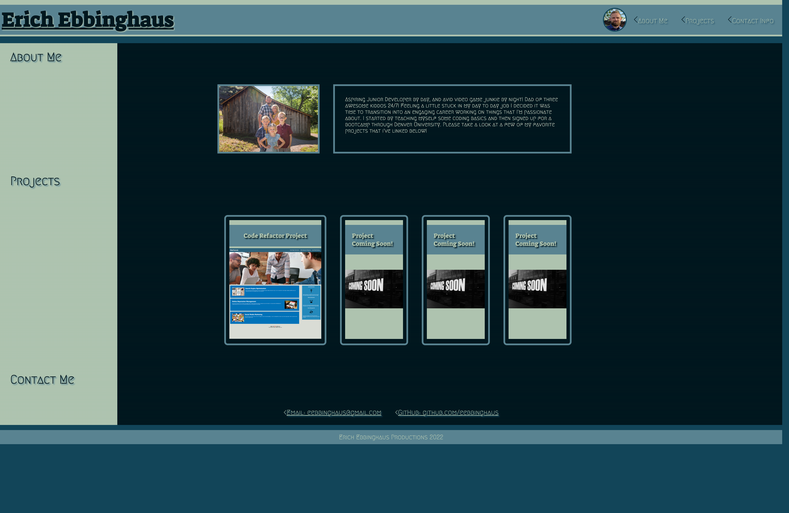

# personal-portfolio

## Description

I created this portfolio to showcase my favorite projects, and to show my coding knowledge with real world examples of the things that i've learned.

This portfolio consists of three different sections. The about me section, my project section as well as a contact section. The links in the navigation section will direct you to the corresponding part of the page. When you click on a project in the projects section you will be directed to the github repository and can launch to the deployed site. This site is a responsive layout that will adapt to various different viewports.

---

## Screenshot

---

## Link to Deployed Application

<https://eebbinghaus.github.io/personal-portfolio/>
